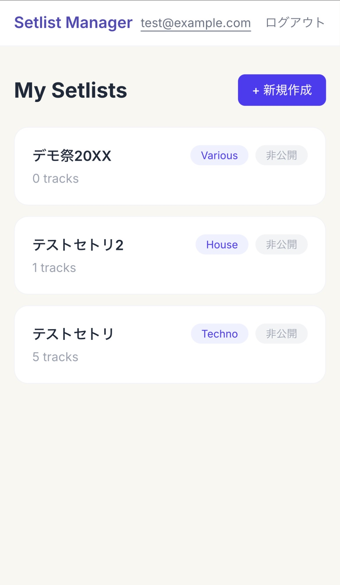
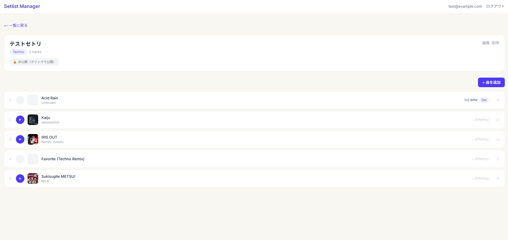
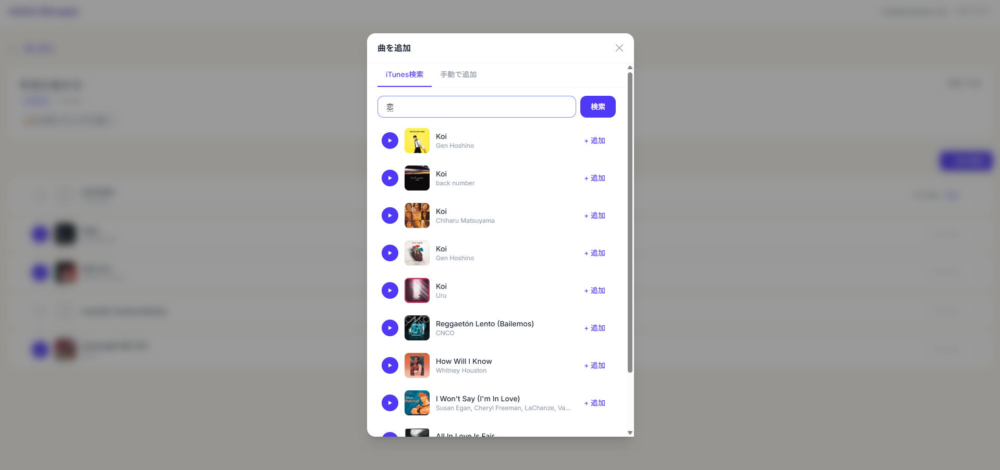

# 🎧 Setlist Manager

DJ向けのセットリスト作成・管理・公開Webアプリ。

**🔗 [https://setlist-manager-tau.vercel.app](https://setlist-manager-tau.vercel.app)**

テストアカウント：`test@example.com` / `123456789`






---

## 📌 このアプリで解決したい課題

DJはセットリストの作成と管理に多くの時間を費やします。既存のメモアプリやスプレッドシートでは以下の課題がありました。

- BPM・キー・アルバムアートを一覧で確認しづらい
- 楽曲のプレビューが手元で聴けない
- Remix・Bootleg等のストリーミングサービス未対応曲を管理しづらい
- 他のDJとセットリストを共有しづらい

このアプリは、これらをワンストップで解決します。私自身がハードテクノ系のDJとして実際に困っていた課題を、エンジニアとしての視点で解決しました。

---

## 🛠 使用技術

| カテゴリ | 技術 | 選定理由 |
|---|---|---|
| フロントエンド | Next.js 15 (App Router) / TypeScript | フルスタック対応・型安全・最新のサーバーコンポーネント活用 |
| スタイリング | Tailwind CSS v4 | CSS-firstな新仕様への対応経験 |
| バックエンド | Next.js API Routes | フロントと同一プロジェクトで開発効率を最大化 |
| DB・認証 | Supabase (PostgreSQL) | RLSによるDBレベルのセキュリティ・OAuth対応 |
| 外部API | iTunes Search API | 認証不要・無料で楽曲メタデータを取得 |
| デプロイ | Vercel | GitHub連携によるCI/CD自動化 |
| 設計ツール | Figma Make | UI設計とプロトタイピング |

---

## ✨ 機能一覧

### 認証
- メールアドレスによるサインアップ・ログイン
- セッション管理（Supabase Auth）

### セットリスト管理
- 作成・編集・削除
- 公開/非公開の切り替え
- ジャンルタグの設定

### 楽曲管理
- iTunes Search APIによる楽曲検索・追加
- 手動入力フォームによるRemix・Bootleg等の楽曲追加
- BPM・キーの編集（DJのためのワークフロー対応）
- アルバムアートの表示
- 30秒プレビュー再生（カスタム音声プレイヤー）
- 削除時のposition自動振り直し

### UX
- 検索モーダルによる作業文脈の維持
- トースト通知による操作フィードバック
- レスポンシブ対応（モバイル・デスクトップ）

---

## 💡 技術選定の理由・工夫した点

### Supabase RLSによるセキュリティ設計

Row Level Securityを用いて、DBレベルで他ユーザーのデータへのアクセスを防いでいます。「ログイン中のユーザーID = データのuser_id」という条件で行レベルのフィルタリングを実装し、APIで認可漏れがあっても安全な多層防御を実現しました。

```sql
CREATE POLICY "自分のsetlistのみ操作可"
  ON setlists FOR ALL
  USING (auth.uid() = user_id);
```

### iTunes Search APIへの切替（問題解決の事例）

当初Spotify APIを使用予定でしたが、2024年の仕様変更により無料アカウントでの利用が制限されました。代替としてiTunes Search APIを採用し、認証不要・無料で同等の楽曲メタデータ取得を実現。`lib/spotify.ts` と `lib/itunes.ts` を分離した設計により、将来的なAPI追加（SoundCloud等）も容易な抽象化を行いました。

### 試聴モードのグローバル状態管理

各コンポーネントが個別に音声状態を持つと、複数同時再生やボタン間の状態のズレが発生します。再生状態はアプリ全体で1つであるべきグローバル状態と判断し、Context APIで一元管理しました。さらにブラウザの`HTMLAudioElement.play()`のPromiseライフサイクルを考慮し、再生中断時の`AbortError`を適切にハンドリングしています。

### モーダルUIの実装

セットリスト管理という主要機能を背面に常時表示しつつ、曲検索を前面のモーダルで提供することで、ユーザーの作業文脈を維持。以下のアクセシビリティ対応を実装しました。

- Escキー・オーバーレイクリック・閉じるボタンの3経路で閉じる
- `role="dialog"` / `aria-modal` 等のARIA属性
- 表示中の背面スクロール抑止
- Flexbox + `min-h-0` による正しいスクロール領域の制御

### 実ユースケースを意識した二経路の楽曲追加

DJが扱うRemix・Bootleg等のストリーミング非対応楽曲も管理できるよう、iTunes検索による自動追加と、ユーザーによる手動追加の2経路を用意。実際のDJワークフローを反映した設計です。

### Tailwind CSS v4への対応

リリース直後のTailwind v4は設定方法が大きく変わり、`tailwind.config.ts`から`@theme`ディレクティブを使ったCSS-firstな設定に移行しました。新技術へのキャッチアップとデバッグ経験を得ました。

---

## 🗂 ディレクトリ構成

```
setlist-manager/
├── app/
│   ├── api/              # APIルート（認証・CRUD・外部API）
│   ├── login/            # ログイン画面
│   ├── setlists/[id]/    # セットリスト詳細画面
│   ├── page.tsx          # ホーム（一覧画面）
│   └── layout.tsx        # 共通レイアウト
├── components/           # 再利用可能なUIコンポーネント
├── context/              # グローバル状態（認証・音声・トースト）
└── lib/                  # 外部API・Supabaseクライアント
```

---

## 🚀 セットアップ方法

### 必要環境
- Node.js v20以上
- npm
- Supabaseアカウント
- Spotify Developer アカウント（任意。iTunes APIは認証不要）

### 1. リポジトリをクローン

```bash
git clone https://github.com/your-username/setlist-manager.git
cd setlist-manager
npm install
```

### 2. Supabaseのセットアップ

[Supabase](https://supabase.com) で新規プロジェクトを作成し、SQL Editorで以下を実行。

```sql
-- セットリストテーブル
CREATE TABLE setlists (
  id uuid PRIMARY KEY DEFAULT gen_random_uuid(),
  user_id uuid REFERENCES auth.users NOT NULL,
  title text NOT NULL,
  genre text,
  is_public boolean DEFAULT false,
  created_at timestamptz DEFAULT now()
);

-- トラックテーブル
CREATE TABLE tracks (
  id uuid PRIMARY KEY DEFAULT gen_random_uuid(),
  setlist_id uuid REFERENCES setlists ON DELETE CASCADE,
  title text NOT NULL,
  artist text,
  bpm integer,
  key text,
  spotify_id text,
  preview_url text,
  image_url text,
  position integer,
  created_at timestamptz DEFAULT now()
);

-- RLS有効化とポリシー
ALTER TABLE setlists ENABLE ROW LEVEL SECURITY;
ALTER TABLE tracks ENABLE ROW LEVEL SECURITY;

CREATE POLICY "自分のsetlistのみ操作可"
  ON setlists FOR ALL USING (auth.uid() = user_id);

CREATE POLICY "自分のtrackのみ操作可"
  ON tracks FOR ALL
  USING (setlist_id IN (SELECT id FROM setlists WHERE user_id = auth.uid()))
  WITH CHECK (setlist_id IN (SELECT id FROM setlists WHERE user_id = auth.uid()));
```

### 3. 環境変数を設定

プロジェクトルートに `.env.local` を作成。

```bash
NEXT_PUBLIC_SUPABASE_URL=your_supabase_url
NEXT_PUBLIC_SUPABASE_ANON_KEY=your_supabase_anon_key
```

### 4. 開発サーバー起動

```bash
npm run dev
```

[http://127.0.0.1:3000](http://127.0.0.1:3000) にアクセス。

---

## 🔮 今後の追加予定

| 機能 | 内容 |
|---|---|
| SoundCloud API対応 | 非公式・Remix楽曲への対応強化 |
| 公開セットリスト閲覧 | 他DJのセトリ閲覧・いいね・フォロー機能 |
| ドラッグ&ドロップ並び替え | 直感的なトラック順序の編集 |
| BPMトランジショングラフ | セット全体の盛り上がりを可視化 |
| プレイリストエクスポート | M3U・CSV形式での書き出し |

---

## 👤 制作者

学生エンジニア
Web・スマホアプリエンジニア志望

ハードテクノを中心としたDJ活動、YouTube向け動画編集を行っており、自分の趣味領域の課題を技術で解決するアプリとして制作しました。
